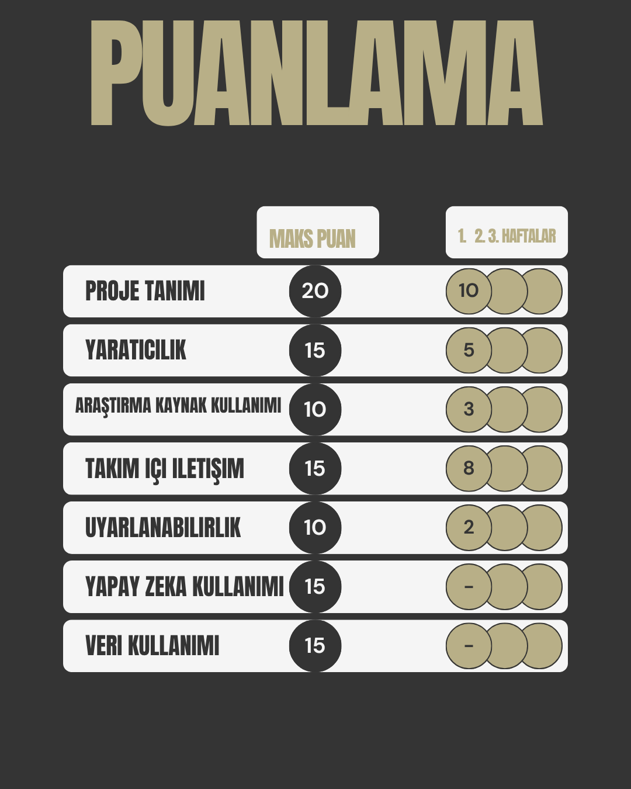
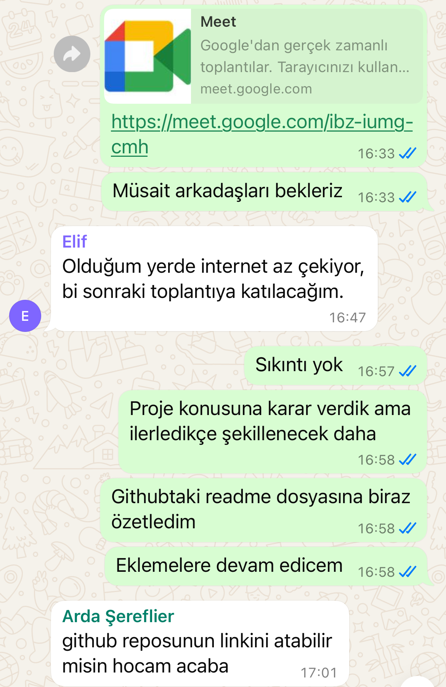
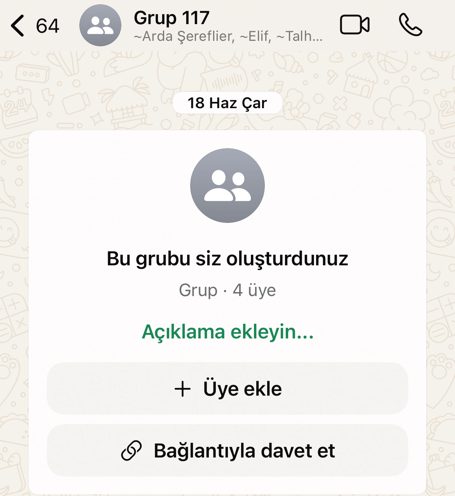
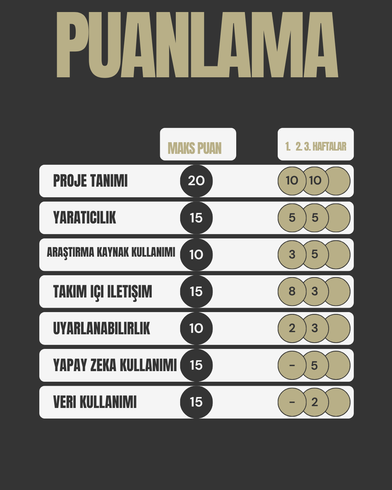
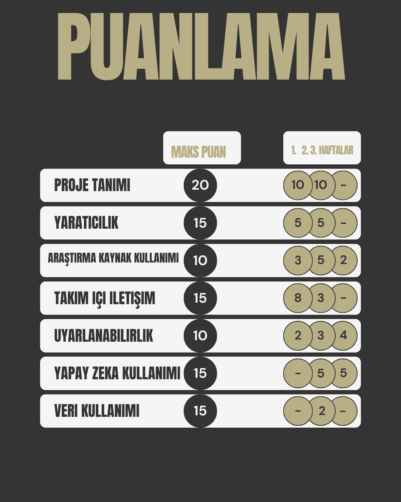
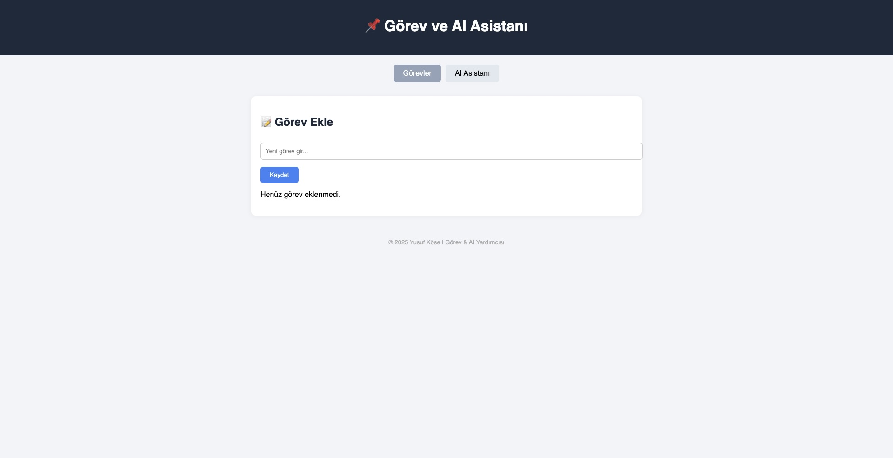

# Grup_117

|__**Ekip Üyeleri**__|
|-|
|Arda Şereflier|
|Elif Uçaktürk|
|Talha Çevik|
|Yusuf Ziya Köse| Scrum Master

---

### Ürün Tanıtımı
- Bu site sayesinde kullanıcılar sadece soru çözümü ile bilgilerini pekiştirmekle kalmayacak aynı zamanda eksiklerini kapatmaları için ilgili videolar izleyebilecekler
---
### Hedef Kitle
- Öğrenciler.
- Çalışan ama zamanı kısıtlı olanlar.
---
### Güçlü Yanlar
- Eğitmenlere her zaman ulaşabilme.
- Aynı tip soruları çözmekle zaman kaybetmeyip geliştirilmesi gereken konulara yönelme ve zaman tasarrufu.
- Tamamen ücretsiz.
- Sadece derslerle kısıtlı kalmayıp rehberlik imkanı. 
---

1.Sprint

<em>Hedef:</em> : Ürünümüzün fikrine karar verme ve görev tanımlarında anlaşma.  
<em>Tamamlanan:</em> Ürünümüzün ne işe yarayacağını hedef kitlesini ve benzeri teorik detaylara karar verdik.
   
 
<strong>Puanlandırma metodları:</strong>

Puanlamaya değer bulduğumuz başlıklar solda. Maksimum alabileceğimiz puanlar sağda. Tahmini olarak 3 haftada bitirmeyi planladığımız için 3 yuvarlak da her hafta kaç puan aldığımızı temsil etmekte.

<h3>Proje Tanımı</h3>
Projemizin en önemli gördüğümüz kısmı. Atacağımız bütün adımları aslında bu adıma bağladık. Projemizin nihai halini baştan oluşturmamaya karar verdik. Yol boyunca öğreneceklerimizden emin olduğumuz için bu kısma <strong>10</strong> puan verdik. İleride artacağına eminiz.
  
<h3>Yaratıcılık</h3>
Kendi hayatlarımızdan da yola çıkarak neye ihtiyacımız olduğunu düşünerek hareket ettik. Üreteceğimiz ürünün aslında ayrı ayrı platformlarda bulunduğunu ama en mantıklısının bunları bir araya getirmek olduğunu fark ettik ve bu noktadan başladık.  Bu da projemizin tamamen başka bir projeden çok; kullanımı kolay olan bir karma app olarak düşünebiliriz anlamına gelir.

<h3>Araştırma Kaynak Kullanımı</h3>
Projenin ileriki aşamalarında daha detaylı kullanacağımızı düşündüğümüz için 3 puan.

<h3>Takım İçi İletişim</h3>
Takımdaki arkadaşlarımızla ilk başlarda iletişim kurmakta zorlansak da daha sonrasında toplantılarımız ve grup mesajlarımız ile iletişimizi sağladık.

<h3>Uyarlanabilirdik</h3>
Gerçek hayatta yer alabileceğini düşünüyoruz. Özellikle hedef kitlemizin de belirttiğimiz gibi zaman kısıtlaması olan bireylerde birçok işlemini tek bir çatı altında yapabilmeleri ürünümüzü cazip kılıyor.

<h3>Yapay Zeka ve Veri Kullanımı</h3>
Teknik detaylara henüz girmediğimiz için puanlama bu şekilde oldu.

<h2>İletişim Kanallarımız</h2>
<li>Çevrimiçi toplantılarımız için -> Google Meet

<li>Mesajlaşmalarımız için -> Whatsapp 
  

<h2>Neleri Daha İyi Yapabiliriz</h2>
<h3>İletişim</h3>
<li>Daha sık toplantı yapıp sorunlarımıza daha hızlı çözüm bulabiliriz.
<h3>Teknik</h3>
<li>Teknik çözümlere odaklanıp daha verimli yollar arayabiliriz
<h3>Araştırma</h3>
<li>Piyasaki diğer benzer uygulamaları kontrol edip kendimizi geliştirebiliriz.

  
 2. Sprint 

  <em>Hedef:</em> Ürünü taslak olarak çalışabilir hâle getirerek incelemek.  
  <em>Tamamlanan:</em> Ürün için gerekli verisetlerinin temizlenmesi, ürün arayüz tasarımı ve kullanılacak toolların kararlaştırılması.
     
  Puanlandırma metodları:
  
  <h3>Araştırma Kaynak Kullanımı</h3>
  Kaggle üzerindeki açık kaynak verisetleri tek tek incelendi, hangi llm'in kullanılacağına dair performans, fiyat vs. araştırmalar yapıldı ve netleştirildi. 
  
  <h3>Takım İçi İletişim</h3>
  Kısıtlı zaman ve diğer projelerin de etkisiyle hafif bir iletişim kopukluğu yaşandı.
  
  <h3>Yapay Zeka ve Veri Kullanımı</h3>
  Yapay zekâ desteğiyle projemizin temel fikirleri üzerine koyarak sürecimizi ve verimliliğimizi arttırdık.
  
  <h2>Neleri Daha İyi Yapabiliriz</h2>
  <h3>İletişim</h3>
  <li>Daha sık toplantı yapıp sorunlarımıza daha hızlı çözüm bulabiliriz.
  <h3>Teknik</h3>
  <li>Teknik çözümlere odaklanıp daha verimli yollar arayabiliriz
  <h3>Araştırma</h3>
  <li>Piyasaki diğer benzer uygulamaları kontrol edip kendimizi geliştirebiliriz.

  
 3. Sprint 

  <em>Hedef:</em> Ürünü çalışabilir hâle getirmek.  
  <em>Tamamlanan:</em> Ürün için gerekli yapay zeka entegrasyonu yapıldı, ürün arayüz tasarımı ve kullanılacak toolların kullanıldı.
     
  Puanlandırma metodları:
  
  <h3>Araştırma Kaynak Kullanımı</h3>
  Kaggle üzerindeki açık kaynak verisetleri tek tek incelendi, hangi llm'in kullanılacağına dair performans, fiyat vs. araştırmalar yapıldı ve netleştirildi. 
  
  <h3>Takım İçi İletişim</h3>
  Kısıtlı zaman ve diğer projelerin de etkisiyle hafif bir iletişim kopukluğu yaşandı.
  
  <h3>Yapay Zeka ve Veri Kullanımı</h3>
  Yapay zekâ desteğiyle projemizin temel fikirleri üzerine koyarak sürecimizi tamamladık.
  
  <h2>Sprint Retrospektif</h2>
  <h3>İletişim</h3>
  <li>Daha sık toplantı yapıp sorunlarımıza daha hızlı çözüm bulabiliriz.
  <h3>Teknik</h3>
  <li>Teknik çözümlere odaklanıp daha verimli yollar arayabiliriz
  <h3>Araştırma</h3>
  <li>Piyasaki diğer benzer uygulamaları kontrol edip kendimizi geliştirebiliriz.
  <h2>Sprint Sonu Beklentileri</h2>
  <li>Hedefimiz kısmen tamamlandı. Ek geliştirmeler sağlanabilir. Daha yüksek bi puan alınabilirdi. İletişim konusunda iyi olunabilirdi.
  <li>Tahmin edilen puanımız:85+ iken yapılan 72.
    
  <h3>Ürün Screenshot</h3>
  

